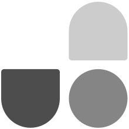

文档转移到<a href="https://github.com/cn-docs/unocss">cn-docs/unocss</a>

<h1 align="center">
UnoCSS
</h1>

即时按需的原子级 CSS 引擎

<a href="https://alfred-skyblue.github.io/unocss-docs-cn/">中文文档</a> ｜ <a href="https://unocss.dev/">英文文档</a>

